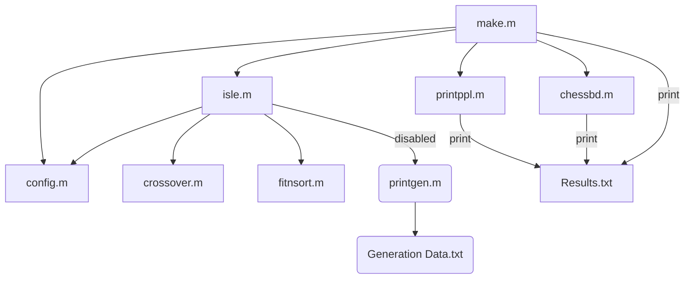

# EE6227 Assignment 4 

*Please open this .md using a Markdown reader for a better experience. [Here](https://stackedit.io/app#) is a very nice online one for you :-)*

This is an island model version of an N-queen algorithm for EE6227 assignment 4 (hereafter "**Archipelago**"), modified from the original algorithm for EE6227 assignment 3 (hereafter "**Islet**"). 

## Environment Requirements and Expected Run Time 

To run Archipelago, the reader may need: 

1. MATLAB, R2013b or above recommended. 
2. Parallel Computing Toolbox (hereafter "**Parbox**"), version 7.4 recommended. 
3. A computer with a multi-core processor, 8-core or above recommended. (Or any other better device) 
4. 16GiB RAM, or at least 4GiB free RAM for running. 

Oldest available MATLAB version for Archipelago might be 2009b, but the reader would need to revise those parallel statements manually so that it works. 

For the reader's reference, my environment is: 

- CPU: 8-core AMD Ryzen 7 5800H 
- RAM: 16GiB, 3200MHz, DDR4 
- MATLAB: R2021a Update 6 
- Parbox: version 7.4 

For a 16-queen, 1000-population, 8-island, \mu = \lambda problem, my machine averages an initialization time of around 40 seconds, and a run time for 0.3s/epoch(10 generations).

Judging from several test results, the initialization time greatly elevates with overall data size, while run time per generation seems to follow population size more than other parameters. 

## Parbox introduction 

*This part is for Parbox newcomers.*

The Parallel Computing Toolbox is a MATLAB toolbox with a size in MiB of a 3-digit number that can be installed directly from MATLAB's built-in resource manager. 

Parbox enables parallel computing on a single computing environment (with multi-core, multi-processors or multi-machines, of course) so that those data intensive problems can be solved more efficiently. This suits very well with island models, and therefore I deployed it in Archipelago. 

The reader may refer [here](https://www.mathworks.com/help/releases/R2021a/parallel-computing/index.html) for detailed information of MathWorks' parbox. 

Basically, I used *parpool(NumWorkers)* and *spmd statements; end* in this code. 

### parpool 

*parpool(NumWorkers)* initializes a cluster of *NumWorkers* workers for following parallel computing workloads. 

*NumWorkers* corresponds to the physical core number of the running cluster, and its limit should be determined by MATLAB automatically. If not, simply type *parpool(512)* in the command window and the initialized pool have the maximum *NumWorkers*. The reader can also change her/his preferred default *NumWorkers* in Parbox's setting page. 

To delete a pool, use *delete(PoolName)* or *delete(gcp('nocreate'))*. *gcp* represents *get current pool* while *'nocreate'* option tells MATLAB that if there is no pool existing, don't generate a new one. 

### spmd 

*spmd* is short for *single programme, multiple data sets*. In its *statements* part, every worker take up their own pieces of workload and starts working on them in parallel. 

If workers return data in same variable names, those data will be overloaded into a *composite* type. For the data passed into *spmd* blocks, vice versa! 

Data for a specific worker can be indexed via *{labindex}*. 

## To Run Archipelago 

First, if you would like to increase or reduce the number of workers, simply go to *config.m* and change the *isle_num* in line 6. Note that this parameter is limited by the maximum *NumWorkers* of your environment. 

Then, simply type *make* in the command window of MATLAB and hit the enter key. 

Archipelago is moderately reconfigurable. The reader may change any parameters in the *config.m* file following the guiding comments. 

Note that island models seem not very good for long chromosome problems. Therefore, it's not recommended to set a too high number of queens. 

## To Check Results 

Running results are stored in the *Results.txt* file in the root directory by default. Printed data include: 

1. Unique solutions on all islands. 
2. Solutions in 1 converted (or, *boardized*) into chessboard forms via the custom *chessbd()* function. 
3. Unique solutions on every island. 
4. Population situations of the last generation on every island. 

It's recommended to *Ctrl+F* and search for the halfwidth colon "*:*", because this file often exceeds 10000 lines and all headings in this file are followed by "*:*". 

The reader may also uncomment line 46 in *isle.m*, enabling the *printgen.m* script to print **all data on all islands in all generations** defaultly in the *Generation Data.txt* file. However, as the script was inherited directly from Islet without debugging, this will take forever and size of the generated file will be unimaginably huge. So, it's never recommended to do so. 

## Code Structure 

*Assignment 1 - for assignment 3 supplement.pdf* file explains the design of fitness function. 

On the microarchitecture level, there is no significant difference between Archipelago and Islet, except that pairing mechanism is changed from portion replacement to best-two-of-bo_num. 

Comments are given at the beginnings for all code blocks for reviewer's reference. The reader may also refer to the *Code Introduction* part in *README_asgn3.md* for detailed algo implementations, and repetitive narrative is thus omitted here in this already tedious README file. 

***Thanks for your review!***